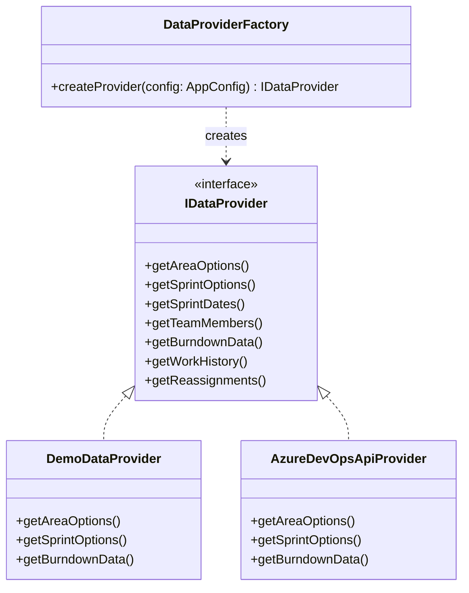

# DevOps Sprint Health Pro Web

A modern, client-side web application built in **TypeScript** that provides deep insights into Azure DevOps sprint performance. It replicates all functionality of the Python desktop version ([DevOps Sprint Health Pro](https://github.com/Eduardo-Zorzan/SprintHealth)), running **100% serverless on GitHub Pages**.

---

## 🌟 Key Features

- **Sprint Health Graphics**: Generate interactive burndown charts and multi-member time-registration bar charts.
- **Client-Side Architecture (GitHub Pages Ready)**: No backend server required. All WIQL queries, OData snapshots, work history aggregation, and reassignment diffing are calculated directly in the browser.
- **Built-in Mock/Demo Mode (`mock://sprint-health`)**: Test the app immediately with full parity deterministic data without needing Azure DevOps credentials.
- **Real-Time System Log**: Built-in terminal log mimicking Python's `RedirectText(sys.stdout)` to display live progress and diagnostics.
- **Persistent Cache via LocalStorage**: Configuration, combo lists, and team members are safely cached in browser `localStorage`.

---

## 🏗️ Architecture & Design Patterns

### 1. The Factory Pattern ([Refactoring Guru](https://refactoring.guru/design-patterns/factory-method))

The application strictly implements the **Factory Method Pattern** in TypeScript across three core layers:



- **`DataProviderFactory`**: Instantiates `DemoDataProvider` (for offline/mock mode) or `AzureDevOpsApiProvider` (for live Azure DevOps REST/WIQL calls) conforming to the `IDataProvider` product interface.
- **`ChartRendererFactory`**: Instantiates `BurndownChartRenderer` or `TimeRegistrationChartRenderer` implementing `IChartRenderer`.
- **`StorageFactory`**: Instantiates `LocalStorageService` with automatic fallback to `InMemoryStorageService` implementing `IStorageService`.

### 2. Storage Analysis: LocalStorage vs. Cookies

| Criteria | Cookies | LocalStorage (Selected) |
| :--- | :--- | :--- |
| **Capacity** | ~4KB (Fails on sprint cache) | **5MB – 10MB** (Optimal for iteration trees & member caches) |
| **Network Overhead** | Sent with every HTTP request to GitHub Pages | **Zero network overhead** (Pure client-side access) |
| **Security in SPA** | `HttpOnly` not available via client JS | Same client-side security model without header bloat |
| **Data Types** | Raw key-value strings | Clean JSON serialization via typed `IStorageService` |

---

## 🚀 Getting Started

### Prerequisites
- Node.js (v18+)
- npm (v9+)

### Installation & Local Development

```bash
# Clone the repository
git clone https://github.com/Eduardo-Zorzan/SprintHealthWeb.git
cd SprintHealthWeb

# Install dependencies
npm install

# Start Vite local development server
npm run dev
```

### Production Build

```bash
npm run build
```
Static assets are output to `dist/` with relative asset links (`base: './'`), ready to be served on any static web server or GitHub Pages.

---

## 🌐 Deploying to GitHub Pages

A pre-configured GitHub Actions workflow is included at [`.github/workflows/deploy.yml`](.github/workflows/deploy.yml).

1. Push your code to GitHub:
   ```bash
   git add .
   git commit -m "Initial commit of SprintHealthWeb"
   git branch -M main
   git remote add origin https://github.com/Eduardo-Zorzan/SprintHealthWeb.git
   git push -u origin main
   ```
2. In your GitHub repository settings, navigate to **Settings** > **Pages**.
3. Under **Build and deployment**, set **Source** to **GitHub Actions**.
4. The workflow will automatically build and publish your site!

---

## 🔒 Azure DevOps Connection & CORS

- **Demo Mode**: Enter `mock://sprint-health` (prefilled by default). Works 100% offline out-of-the-box.
- **Live DevOps**: When calling cloud Azure DevOps (`dev.azure.com`) directly from a browser, browsers enforce CORS restrictions. For live connections, you can:
  - Use an internal/on-premise Azure DevOps server with CORS enabled.
  - Or configure the optional **CORS Proxy URL** field under **Advanced Settings** (e.g. your organization's proxy or an edge function).
# SprintHealthWeb
